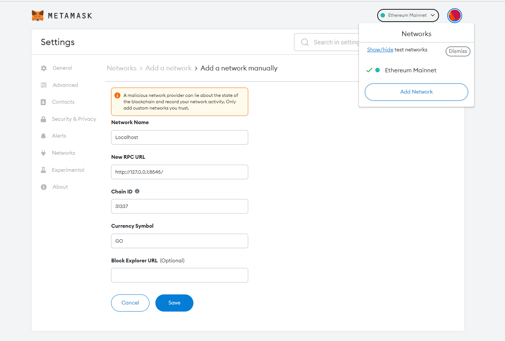
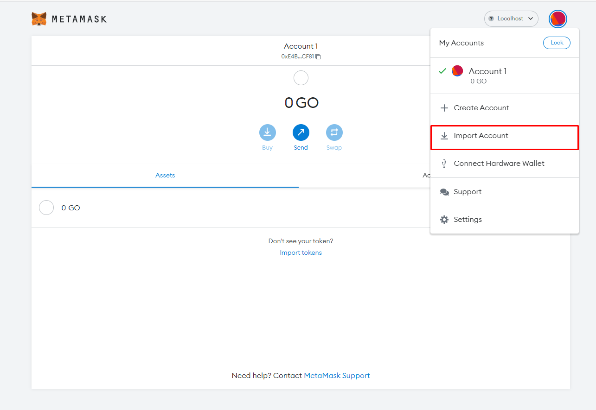
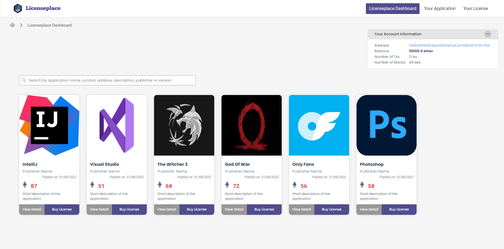
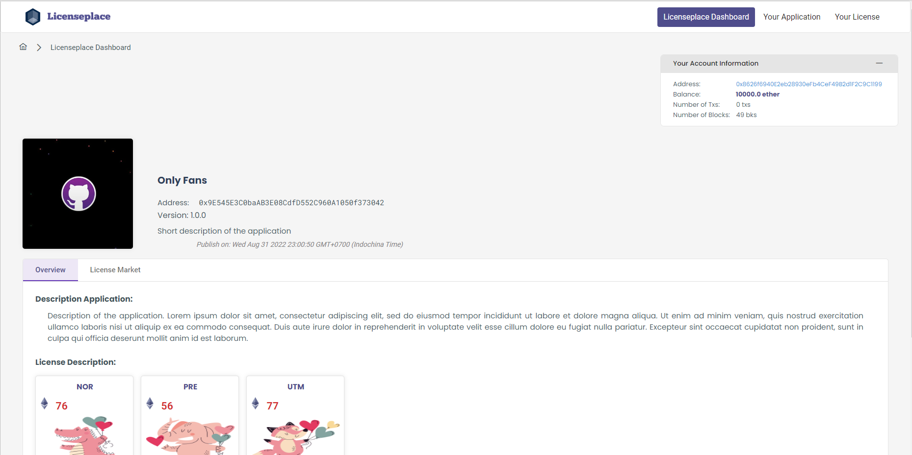
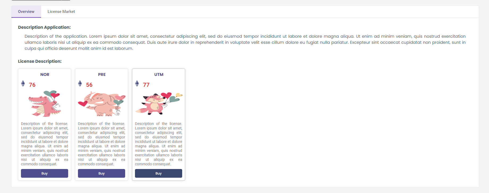
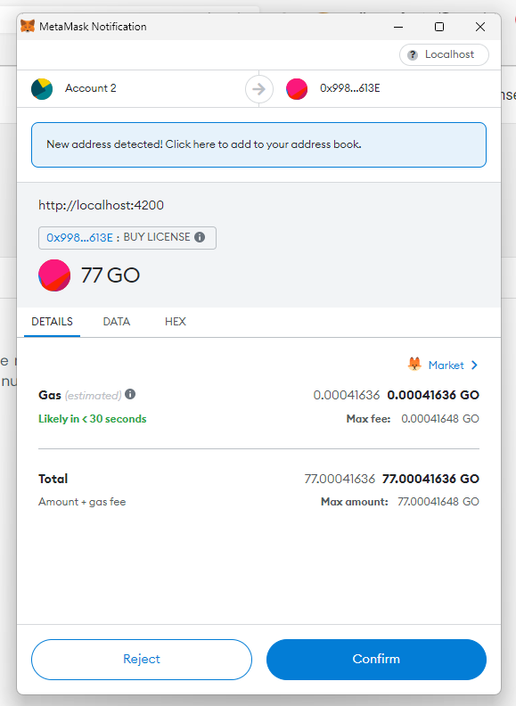
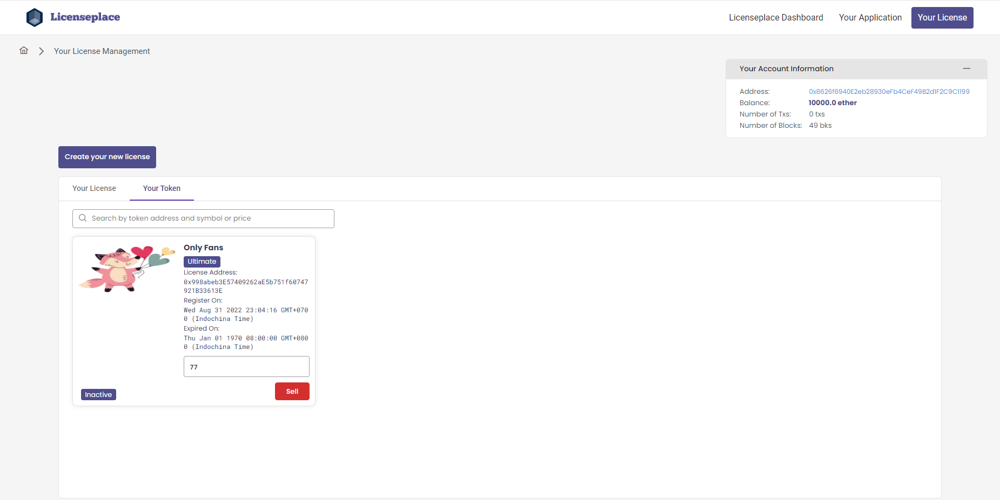
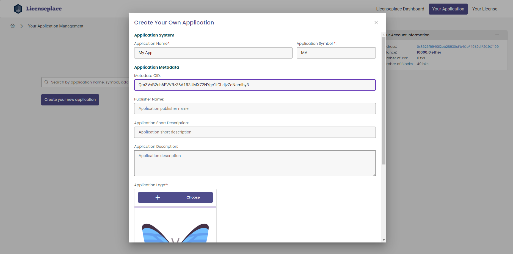

# LicensePlace

The marketplace for selling and redistributing software license

## Requirements

To run this project, you need to have:

- NodeJS
- IPFS
- Meta Mask

## Installation

The project has 3 part:

- IPFS: A decentralized file server to store images
- Smart contract: A Ethereum blockchain that mine, store transactions and execute the smart contracts
- Front-end: The UI of **LicensePlace**

### Running IPFS

You can run a IPFS server via `docker-compose.yml` in `./ipfs` folder or download the app at [IPFS Desktop | IPFS Docs](https://docs.ipfs.tech/install/ipfs-desktop/)

Go to `./smart-coontract/scripts`, upload folder `sample-img` to your IPFS server. They will be the sample data

### Running Smart Contract

- Open a terminal at `./smart-contract`, run `npm i` to install dependencies.

- After that, run `npx hardhat node` to start an development Ethereum blockchain

```shell
> npx hardhat node

Started HTTP and WebSocket JSON-RPC server at http://127.0.0.1:8545/

Accounts
========

WARNING: These accounts, and their private keys, are publicly known.
Any funds sent to them on Mainnet or any other live network WILL BE LOST.

Account #0: 0xf39Fd6e51aad88F6F4ce6aB8827279cffFb92266 (10000 ETH)
Private Key: 0xac0974bec39a17e36ba4a6b4d238ff944bacb478cbed5efcae784d7bf4f2ff80

Account #1: 0x70997970C51812dc3A010C7d01b50e0d17dc79C8 (10000 ETH)
Private Key: 0x59c6995e998f97a5a0044966f0945389dc9e86dae88c7a8412f4603b6b78690d

Account #2: 0x3C44CdDdB6a900fa2b585dd299e03d12FA4293BC (10000 ETH)
Private Key: 0x5de4111afa1a4b94908f83103eb1f1706367c2e68ca870fc3fb9a804cdab365a

...
```

- Open another terminal at `./smart-contract`, run `npx hardhat run scripts/deploy.js --network development` to deploy the smart contract and some samples data to the blockchain

```shell
> npx hardhat run scripts/deploy.js --network development

Nothing to compile
No need to generate any newer typings.
License Place Contract deployed to:  0x5FbDB2315678afecb367f032d93F642f64180aa3
Create IntelliJ at 0xe7f1725E7734CE288F8367e1Bb143E90bb3F0512
License: Create Normal at 0xCf7Ed3AccA5a467e9e704C703E8D87F634fB0Fc9
License: Create Premium at 0x5FC8d32690cc91D4c39d9d3abcBD16989F875707
License: Create Ultimate at 0xa513E6E4b8f2a923D98304ec87F64353C4D5C853
Create 3 licenses for IntelliJ
Create Visual Studio at 0x8A791620dd6260079BF849Dc5567aDC3F2FdC318
License: Create Normal at 0xB7f8BC63BbcaD18155201308C8f3540b07f84F5e
License: Create Premium at 0x0DCd1Bf9A1b36cE34237eEaFef220932846BCD82
License: Create Ultimate at 0x0B306BF915C4d645ff596e518fAf3F9669b97016
Create 3 licenses for Visual Studio
Create The Witcher 3 at 0x9A9f2CCfdE556A7E9Ff0848998Aa4a0CFD8863AE
License: Create Normal at 0x3Aa5ebB10DC797CAC828524e59A333d0A371443c
License: Create Premium at 0x59b670e9fA9D0A427751Af201D676719a970857b
License: Create Ultimate at 0x322813Fd9A801c5507c9de605d63CEA4f2CE6c44
Create 3 licenses for The Witcher 3

...
```

### Running Front-end

- Notice the account list and `License Place Contract deployed to:  0x5FbDB2315678afecb367f032d93F642f64180aa3`. You would need them in this step

- Download [The crypto wallet for Defi, Web3 Dapps and NFTs | MetaMask](https://metamask.io/) extension for your browser. Add Network > Fill in like the image



- Log in to one of accounts above



- Open a terminal at `./front-end`, run `npm i`

- Go to `.\front-end\src\app\common\smart-contract-address.constant.ts`, change `LICENSEPLACE_SMART_CONTRACT_ADDRESS` to above address
- Go to `.\front-end\src\app\common\ipfs.constant.ts`, change `IPFS_HOST` to your appropriate value
- Finally, run `npm start`

## Result














